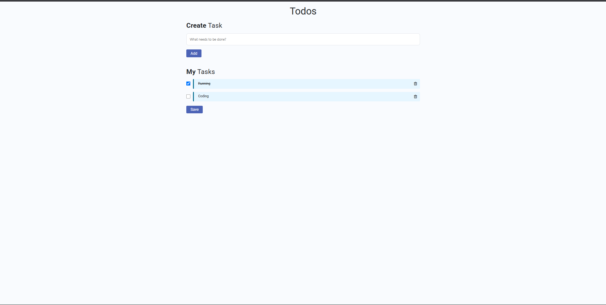

# 📝 To-Do List Web App

A simple and responsive To-Do List web application built using **HTML**, **CSS**, **JavaScript**, and **Bootstrap 4**. It allows users to create, track, check off, and delete tasks, with persistent storage using `localStorage`.

## 🚀 Features

- ✅ **Add Tasks**: Enter and add new tasks to your list.
- 🧾 **View All Tasks**: Displays all your current tasks dynamically.
- ✔️ **Mark as Done**: Check/uncheck tasks to mark them as complete/incomplete.
- 🗑️ **Delete Tasks**: Remove tasks you no longer need.
- 💾 **Save Tasks**: Persists your to-dos in the browser using `localStorage`, even after refresh.
- 📱 **Responsive Design**: Built with Bootstrap 4 for a mobile-friendly UI.
- 🎨 **Custom Styling**: Clean and attractive UI

## 🛠️ Tech Stack

- **HTML5**
- **CSS3**
- **JavaScript (ES6)**
- **Bootstrap 4**
- **Font Awesome** (for delete icons)
- **LocalStorage API** (for persistent data)

## 🧠 How It Works

### 1. Add Tasks
Type a task into the input box and click the **"Add"** button. It will be added to the task list.

### 2. Mark Tasks Complete
Click the checkbox next to a task. This toggles its completed state and applies a visual "checked" style.

### 3. Delete Tasks
Click the 🗑️ trash icon to remove a task from the list.

### 4. Save Tasks
Click the **"Save"** button to manually save the current list to `localStorage`.

> 💡 All tasks are loaded from `localStorage` on page reload.

## 📸 Preview

> 
> 

## 🔧 Setup Instructions

1. Clone this repository:
   ```bash
   git clone https://github.com/your-username/todo-list-app.git
   cd todo-list-app
2. Open index.html in your browser:

## 📄 License
This project is open-source and free to use under the MIT License.

## 👤 Author
@BhangaleGunjan
